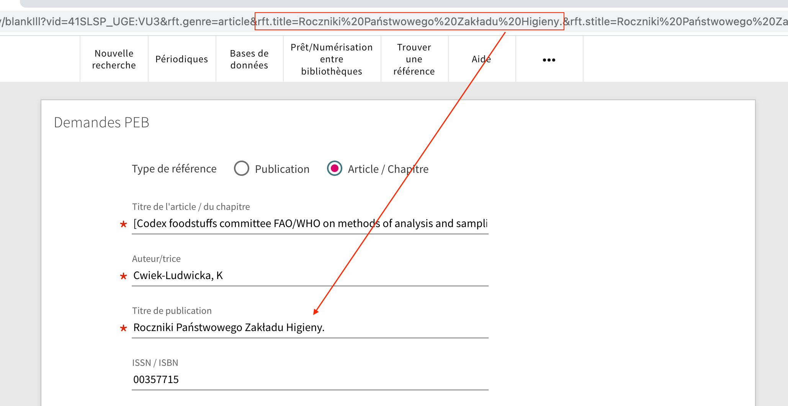

# Autofill blank ILL form using openURL parameters

This module reads [openURL](https://en.wikipedia.org/wiki/OpenURL) parameters appended to a blank ILL URL to autofill inter-library loan (ILL) requests.




Because of particularities of the SLSP network, ExLibris' ILL Rapido solution is being used to handle network sharing. UNIGE thus has to rely
on Primo's blank ILL form to handle inter library loan requests without the help of the getIt service to autofill relevant bibliographic
information. To prevent asking users to enter all this information manually, we are encoding it in openURL parameters when linking to the
blank ILL form.

Binding directive: `prm-blank-ill-after`

## Usage

### Enable the module

To enable this module, copy it inside your view's Javascript folder, import it into your `main.js` and add `unigeIllOpenUrl` to the list of declared modules.

Following our network practice, at UNIGE we try to keep this folder organized by the directives to which modules are bound, but you don't have to.
Accordingly, enabling modules is done in a two-step process:

In `prm-blank-ill-after/index.js`:

```JavaScript
require('./unige-ill-open-url/unige-ill-open-url.module.js')
module.exports = 'unigeIllOpenUrl'

```

In `main.js`:

```JavaScript
import './prm-blank-ill-after';

var app = angular.module('viewCustom', [(...), 'unigeIllOpenUrl']);

```

Alternatively, you can also directly require the module file in your `main.js` (adjust the path to the module accordingly):

```JavaScript
require('./prm-blank-ill-after/unige-ill-open-url/unige-ill-open-url.module.js')

var app = angular.module('viewCustom', [(...), 'unigeIllOpenUrl']);

```

### Supported openURL parameters and mapping rules

Currently, the following openUrl [Key/Encoded-Value (KEV)](https://oclc-research.github.io/OpenURL-Frozen/docs/implementation_guidelines/KEV_Guidelines-20041209.pdf) 
parameters are supported. It is possible to add others by modifying the `param_map` dictionary.
Additionnally, some parameters have specific mapping rules depending on context.

| Open URL key           | Mapped to form field | Note                                                          |
|------------------------|----------------------|---------------------------------------------------------------|
| `rft.title`            | `title`              |                                                               |
| `rft.atitle`           | `articleTitle`       |                                                               |
| `rft.jtitle`           | `journalTitle`       | Only if `rft.genre != 'journal'`.                             |
| `rft.jtitle`           | `title`              | Only if `rft.genre == 'journal'` (request for whole journal issue)                        |
| `rft.btitle`           | `title`              |                                                               |
| `rft.au`               | `author`             |                                                               |
| `rft.aufirst`          | `author`             | Concatenated from `rft.aufirst`, `rft.auinit` and `rft.aulast` only if `rft.au` is empty. |
| `rft.auinit`           | `author`             | "                                                             |
| `rft.aulast`           | `author`             | "                                                             |
| `rft.publisher`        | `publisher`          |                                                               |
| `rft.place`            | `publisher`          | Concatenated to `publisher` field if present.                 |
| `rft.pubdate`          | `publicationDate`    |                                                               |
| `rft.date`             | `publicationDate`    | Only if `rft.pubdate` is empty.                               |
| `rft.issn`             | `issn`               |                                                               |
| `rft.issn`             | `isbn`               | Only if `rft.genre == 'journal'` (request for whole journal issue)                        |
| `rft.isbn`             | `isbn`               |                                                               |
| `rft.doi`              | `doi`, `comment`     | Added to `comment` field if `rft.genre == 'book'` or `rft.genre == 'journal'`.            |
| `rft.spage`            | `startPage`          | Not displayed on the form but supported by Alma (?)           |
| `rft.epage`            | `endPage`            | Not displayed on the form but supported by Alma (?)           |
|                        | `pagesToPhotocopy`   | Concatenated from `rft.spage` and `rft.epage`.                |
| `rft.edition`          | `edition`            |                                                               |
| `rft.volume`           | `volume`, `comment`  | Only if `rft.genre != "article"`. Added to `comment` field if `rft.genre == 'book'` or `rft.genre == 'journal'`. |
| `rft.volume`           | `journalVolume`      | Only if `rft.genre == "article"`                              |
| `rft.issue`            | `issue`, `comment`   | Added to `comment` field if `rft.genre == 'book'` or `rft.genre == 'journal'`.            |
| `rft.part`             | `comment`            | Added to `comment` field if `rft.genre == 'book'` or `rft.genre == 'journal'`.            |
| `rft.pmid`             | `pmid`               | PubMed ID                                                     |
| `rft.genre`            | `citationType`       | `citationType` is set to `CR` if `rft.genre == 'article'` (article) or if `rft.genre == 'book'` and there is a non-empty `rft.atitle` (book chapter). This switches the form display accordingly. |

### Dependencies

There are no dependencies for this module.

## Known issues

No known issues at this time.

## Changelog

* 2023-06-14 [TG] Added documentation.
* 2023-05-12 Pushed to production
* 2023-04-15 [TG] Released module for internal testing.

## Credits

Thanks to [Tamara Marnell (@tmarnell)](https://github.com/tmarnell) for help in developing this module!