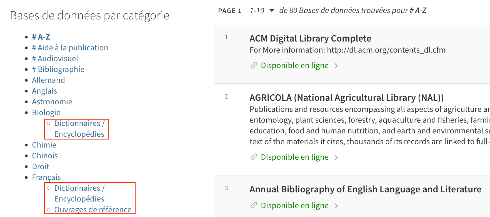

# Rebuild category browse menu on databases list

The databases list page (`discovery/dbsearch`) is built according to categories assigned to online database records in Alma. However, only items
from the database list are displayed here. UNIGE wanted a way to add other online resources that are managed as bibliographic records, such as 
encyclopedias and dictionaries, to the browse menu. This is a natural location for users to look for all online references, regardless of the way
they are catalogued.

This module adds additional entries for dictionaries or reference works in the database categories menu. These links lead to a search query for
particular subject codes that have been added to such online reference records (in field 960$a). 
These codes, as well as for which subject the search links are to be displayed, can be defined in the config file.

Since the built-in categories menu cannot be altered easily, it is entirely rebuilt (as simple nested unordered list elements) and replaces the original menu.



Binding directive: `prm-databases-categorize-after`

## Usage

### Enable the module

To enable this module, copy it inside your view's Javascript folder, import it into your `main.js` and add `unigeDbCategories` to the list of declared modules.

Following our network practice, at UNIGE we try to keep this folder organized by the directives to which modules are bound, but you don't have to.
Accordingly, enabling modules is done in a two-step process:

In `prm-databases-categorize-after/index.js`:

```JavaScript
require('./unige-db-categories/unige-db-categories.module.js')
module.exports = 'unigeDbCategories'

```

In `main.js`:

```JavaScript
import './prm-databases-categorize-after';

var app = angular.module('viewCustom', [(...), 'unigeDbCategories']);

```

Alternatively, you can also directly require the module file in your `main.js` (adjust the path to the module accordingly):

```JavaScript
require('./prm-databases-categorize-after/unige-db-categories/unige-db-categories.module.js')

var app = angular.module('viewCustom', [(...), 'unigeDbCategories']);

```

### Edit configuration file

The following parameters can be controlled inside the `unige-db-categories.config.js` file:

* Base search query to be used in the additional links in the `baseurl` string. Mind that the query has to include a search scope that will be different for your library.
* For which categories the additional links should be displayed.
* What search codes to use for each category.

The latter two are handled in the `refcode` object. The key for each entry is the category term assigned to databases in Alma in the original language they
were entered (French in the case of UNIGE). These keys are case sensitive and mindful of accents, extra spaces, etc. Be sure to spell them exactly as they
are used in the databases list.

For each category key, you can specify a code for encyclopedias and dictionaries (`enc`) and/or other reference works (`ore`). 
Only codes explicitely defined here will be displayed.

The following sample config corresponds to the entries displayed in the screenshot above.

```JavaScript
export const unigeDbCategoriesConfig = {
        baseurl : 'search?pfilter=rtype,exact,books,AND&tab=41SLSP_UGE_MyInst_CI&search_scope=MyInst_and_CI&mode=advanced&offset=0&query=any,contains,',
        refcode: {
            'Biologie': {
                enc: 'ENC_BIO'
            },
            'Français': {
                enc: 'ENC_FRA',
                ore: 'ORE_FRA'
            }
        }
}
```

### Dependencies

For this module to work, you need to use the codes defined above in the 960$a of reference works you want to be searchable for each subject.

This module also requires the following labels to be defined in order to properly display text in the correct language. Here are the labels
we are using, which you can customize:

```
ViewIt Labels : unige.databasesearch.enc

EN : Dictionaries / Encyclopaedias
FR : Dictionnaires / Encyclopédies
DE : Wörterbücher / Enzyklopädien
IT : Dizionari / Enciclopedie

ViewIt Labels : unige.databasesearch.ore

EN : Reference works
FR : Ouvrages de référence
DE : Nachschlagewerke
IT : Opere di riferimento
```

## Known issues

* CSS needs to be adapted to move the rebuilt categories list to the hamburger menu on mobile/responsive.

## Changelog

* 2023-06-14 [TG] Added documentation.
* 2023-05-30 [TG] Released module for internal testing.

