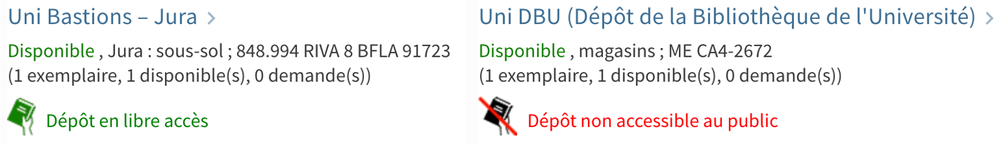

# Display open/closed stacks notice in Primo

This is a modified version of the module [usi-location-open-close](https://github.com/binde77/41SLSP_USI-BiUSI/tree/master/js/modules/prm-location-holdings-after/usi-location-open-close)
developed by the Università della Svizzera Italiana library (BiUSI).

If a displayed item belongs to UNIGE, it checks against a list of locations to identify whether the item is on open or closed stacks:



Binding directive: `prm-location-holdings-after/usi-location-open-close-component`

## Usage

### Enable the module

To enable this module, copy it inside your view's Javascript folder. Following our network practice, at UNIGE we try to keep this folder organized
by the directives to which modules are bound, but you don't have to.

This modules binds to the `prm-location-holdings-after` Primo directive. To prevent collision with other modules using this directive, we are adding
a new `usi-location-open-close-component` directive in [`prm-location-holdings-after.module.js`](../prm-location-holdings-after.module.js) to which
we are binding this module.

Alternatively, if you don't have other modules binding to `prm-location-holdings-after`, you can also modify the code to bind to this directive instead.
After you do so, make sure to `require` the module's folder and to declare the module in your `main.js` file.

### Edit configuration file

Edit `usi-location-open-close.config.js` according to your needs: list of closed location codes and your library ID.

### Dependencies

This module requires the [eth-config service](../../services/eth-config.service.js). At UNIGE, we are using this service for multiple modules, 
so we are keeping a single copy of it in a dedicated  folder. You can also copy the service file inside this module. Make sure to edit the 
`require` statement accordingly.

This module also requires the following labels to be defined in order to properly display text in the correct language. Here are the labels
we are using, which you can customize:

```
ViewIt Labels : unige.stacks_open

EN : Open Stacks
FR : Dépôt en libre accès
DE : Frei zugänglich
IT : A libero accesso

ViewIt Labels : unige.stacks_closed

EN : Closed Stacks
FR : Dépôt non accessible au public
DE : Geschlossener Standort
IT : A scaffale chiuso
```

It also requires two icons to be stored in the view's `img` directory. Mind that their URL in `usi-location-open-close.html` has the view ID
hard coded, which needs to be edited according to yours.

## Known issues

* The view ID is hard coded in the HTML template file for linking to the icons. It would be good to make this independent of the view ID.

## Changelog

* 2023-06-21 [TG] Added watcher to update display when multiple locations are present and when browsing search results.
* 2023-06-14 [TG] Adapted module to UNIGE's context from BiUSI.

## Credits

[Original Primo module](https://github.com/binde77/41SLSP_USI-BiUSI/tree/master/js/modules/prm-location-holdings-after/usi-location-open-close) from Silvio Bindella (BiUSI). 