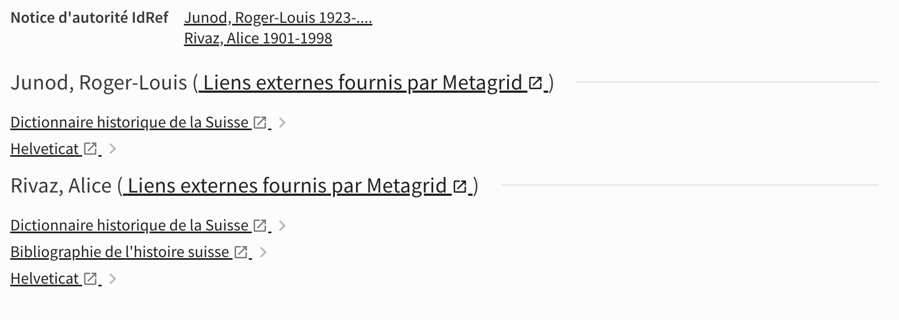

# Display linked authority data from the Metagrid service

This is a modified version of the module
[primo-explore-eth-metagrid](https://gitlab.com/ethlibrary/primo-explore-modules/primo-explore-eth-metagrid/-/tree/master/js)
developed by the ETH Library. You can read more about this module [on its npm page](https://www.npmjs.com/package/primo-explore-eth-metagrid).

The module uses the Swiss linked open data service [Metagrid](https://metagrid.ch/) to display links to selected providers for authorities
identified on a record.




Binding directive: `prm-service-details-after/eth-metagrid-component`

### Differences with original ETH module

* Uses IdRef as well as GND identifiers to look up entities in Metagrid (instead of only GND).
* Supports either whitelisting (only display selected services) or blacklisting (display all services except listed) Metagrid providers (instead of whitelisting only).
* Supports ViewIt labels to control displayed text instead of hard-coded English-only text.

## Usage

### Enable the module

To enable this module, copy it inside your view's Javascript folder. Following our network practice, at UNIGE we try to keep this folder organized
by the directives to which modules are bound, but you don't have to.

This modules binds to the `prm-service-details-after` Primo directive. To prevent collision with other modules using this directive, 
a new `eth-metagrid-component` directive is added in [`prm-service-details-after.module.js`](../prm-service-details-after.module.js) to which
this module is bound.

Alternatively, if you don't have other modules binding to `prm-service-details-after`, you can also modify the code to bind to this directive instead.
After you do so, make sure to `require` the module's folder and to declare the module in your `main.js` file.

### Edit configuration file

Edit `eth-metagrid.config.js` according to your needs.

The configuration file supports either a whitelist (only display selected services) or blacklist (display all available services except listed).
If both a whitelist and a blacklist are provided, only the whitelist will be used. If neither are defined, all available Metagrid links will be displayed.

To prevent selected services from being displayed, add them to a `blacklist` array:

```JavaScript
        blacklist:
            ["viaf", "sudoc", "gnd", "histhub"],
```

Alternatively, specify a `whitelist` array to only display selected services:

```JavaScript
        whitelist:
            ["bsg", "dodis", "helveticat", "hls-dhs-dss", "histoirerurale"]
```

The full list of available Metagrid providers can be found here: [providers.json](https://api.metagrid.ch/providers.json). Use the `slug` value for each
service to refer to them in the arrays above.

All displayed Metagrid services must have their full name defined in the config file as well for all available display languages:

```JavaScript
    label: {
            'bsg': {
                de: 'Bibliographie der Schweizergeschichte',
                en: 'Bibliography on Swiss History',
                fr: 'Bibliographie de l\'histoire suisse',
                it: 'Bibliografia della storia svizzera'
            }
        }
```

Failing to provide a suitable translation will cause the slug to be displayed instead of a full name and an error will be logged to the console.

### Dependencies

This module looks for GND identifiers in local field `lds03` and IdRef identifiers in local field `lds90`. These must be defined on the Alma backend for
the module to work.

This module requires the [eth-config service](../../services/eth-config.service.js). At UNIGE, we are using this service for multiple modules, 
so we are keeping a single copy of it in a dedicated  folder. You can also copy the service file inside this module. Make sure to edit the 
`require` statement accordingly.

This module also requires the following label to be defined in order to properly display text in the correct language:

```
ViewIt Labels : unige.metagrid.by

EN : External links provided by Metagrid
FR : Liens externes fournis par Metagrid
```

## Known issues

No known issues at this time.

## Changelog

* 2023-06-14 [TG] Added documentation.
* 2023-05-12 Pushed to production
* 2023-05-01 [TG] Adapted module to UNIGE's context from ETH.

## Credits

[Original Metagrid Primo module](https://www.npmjs.com/package/primo-explore-eth-metagrid) from Bernd Uttenweiler (ETH Zürich library). Inspiration for using IdRef in lds90 local field from a modified version of the module by Renouvaud (BCU Lausanne).