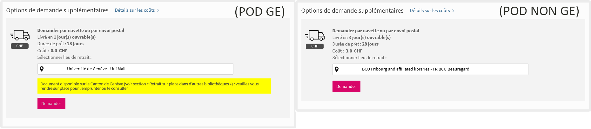

# Modifiy the Rapido form for the Geneva POD

The purpose of this module is to modify the Rapido form if the conditions correspond to the Geneva POD, which has been set up to cancel requests between participating Geneva IZs. This POD is the only one that uses a delivery time of 1 day, so we can use this time parameter to disable the "Request" button and display an explanatory message. In specific terms, if the parameter "bestoffer.supplyTime" = 1 day then the label "unige_rapido_pod" is displayed just before the "requestButton", and this button is disabled. If the parameter "bestoffer.supplyTime" is different than 1 day then the display is left as-is.



Binding directive: `prm-service-physical-best-offer-after`

## Usage

### Enable the module

To enable this module, copy the folder "unige-local-pod-disable" inside your view's "js/prm-service-physical-best-offer-after" folder, and add the following lines to the file "js/prm-service-physical-best-offer-after/prm-service-physical-best-offer-after.module.js":

```JavaScript
import { unigeLocalPodDisableModule } from './unige-local-pod-disable/unige-local-pod-disable.module';
```

The "template" variable has to be modified to add the new component "unige-local-pod-disable-component":

```JavaScript
template: `<slsp-rapido-digital-offer-component after-ctrl="$ctrl"></slsp-rapido-digital-offer-component>
    <slsp-icon-label-rapido-component after-ctrl="$ctrl"></slsp-icon-label-rapido-component>
    <eth-disable-request-button-component after-ctrl="$ctrl"></eth-disable-request-button-component>
    <slsp-service-physical-best-offer-after parent-ctrl="$parent.$ctrl"></slsp-service-physical-best-offer-after>
    <unige-local-pod-disable-component after-ctrl="$ctrl"></unige-local-pod-disable-component>`,
```
Add also the following line at the end of the file:

```JavaScript
prmServicePhysicalBestOfferAfterModule.requires.push(unigeLocalPodDisableModule.name);
```

### Dependencies

This module requires the following labels to be defined in order to properly display text in the correct language. The style of the message is hardcoded in the label and can be modified. Only the id="alertpodge" is mandatory because it is used to avoid the display of the message several times:

```
ViewIt Labels: unige_rapido_pod

EN : <p id="alertpodge" style="background-color: yellow; padding: 10px;">Document available in the Geneva area (see section "Pick up on site at other libraries"): please visit the library to borrow or consult it.</p>
FR : <p id="alertpodge" style="background-color: yellow; padding: 10px;">Document disponible sur le Canton de Genève (voir section « Retrait sur place dans d’autres bibliothèques ») : veuillez vous rendre sur place pour l’emprunter ou le consulter</p>

```

## Known issues

No known issues at this time.

## Changelog

* 2023-09-22 [PI] Added documentation.
* 2023-09-15 [PI] Pushed to UNIGE production view.
* 2023-09-15 [PI] Modifications to solve the problem linked to the SWITCH edu-ID login: the submit button comes after the rapido calculations and is not available to apply the modifications.
* 2023-09-13 [TG] Pushed to test in UNIGE SandBox.
* 2023-09-12 [TG] Released module for internal testing.
