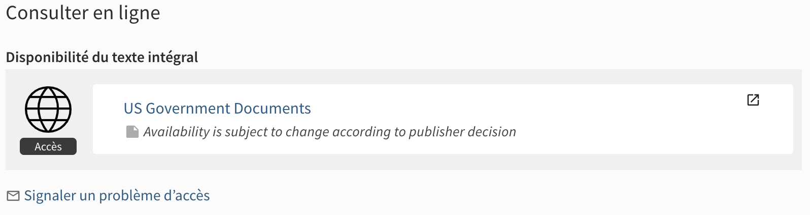

# E-mail feedback prompt for e-resources access issues

This is a modified version of the module [eth-online-feedback-mail ](https://gitlab.com/ethlibrary/slsp/customization-eth-view/-/tree/master/js/modules/prm-alma-delivery-after/eth-online-feedback-mail)
developed by the ETH Library, and further customized by BCU-Fribourg.

This module displays a `mailto:` link prompting users to submit feedback if they encounter issues while accessing electronic resources.
The email draft prepared for the user is pre-filled with information useful to address the issue.



Binding directive: `slsp-alma-viewit-after` ([SLSP custom directive](https://github.com/Swiss-Library-Service-Platform/swisscovery/blob/main/41SLSP_NETWORK-VU1_UNION/js/slsp-archives-viewit/js/slsp-archives-viewit.module.js) inside `prm-alma-viewit-after`).

## Usage

### Enable the module

To enable this module, copy it inside your view's Javascript folder, import it into your `main.js` and add `bcuOnlineFeedbackModule` to the list of declared modules.

Following our network practice, at UNIGE we try to keep this folder organized by the directives to which modules are bound, but you don't have to. 

We also defined our own subdirective `bcu-online-feedback` because we have several modules binding to `slsp-alma-viewit-after`.
Accordingly, the subdirectives and module declaration is done in [`slsp-alma-viewit-after/slsp-alma-viewit-after.module.js`](../slsp-alma-viewit-after.module.js). 

[`slsp-viewit-after`](https://github.com/Swiss-Library-Service-Platform/swisscovery/blob/main/41SLSP_NETWORK-VU1_UNION/js/slsp-archives-viewit/js/slsp-archives-viewit.module.js) is itself a custom directive defined by the SLSP network package to which UNIGE is part of.
If you want to use this module outside of SLSP, you will need to edit it so it binds to `prm-alma-viewit-after` instead.

### Edit configuration file

The text that is displayed by the module is defined in [`bcu-online-feedback.config.js`](bcu-online-feedback.config.js).

### Edit CSS

The following CSS code should be added to your custom.css (or equivalent). Edit as required.

```CSS
prm-full-view-service-container .section-body .bcu-online-feedback-mail {
  margin-top: 1em;
}
```

### Dependencies

This module requires the [eth-config](../../services/eth-config.service.js) and [unige-userid](../../services/unige-userid.service.js)
services. At UNIGE, we are using these services for multiple modules, 
so we are keeping a single copy in a dedicated  folder. You can also copy the service files inside this module. Make sure to edit the 
`require` statement accordingly.

## Known issues

No known issues at this time.

## Changelog

* 2024-07-02 [TG] Released module for internal testing.

## Credits

The original [eth-online-feedback-mail module ](https://gitlab.com/ethlibrary/slsp/customization-eth-view/-/tree/master/js/modules/prm-alma-delivery-after/eth-online-feedback-mail) was developed at ETH Zurich. Our version builds on a copy of this module further customized for BCU-Fribourg.