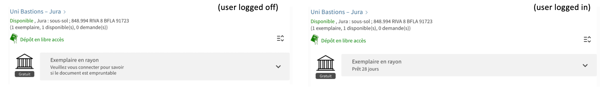

# Display custom message for non-circulating items

Displayed loan policies in Primo are currently defined by the fulfillment terms of use, which are only available when users are logged in.
Consequently, loan policies are often mistakenly displayed for users that are not logged in. Instead, it would be beneficial for the loan
policy display to be controlled by item or location policies. 
This is [a long-expected and heavily requested feature](https://ideas.exlibrisgroup.com/forums/308176-primo/suggestions/36317461-display-item-policy-in-item-record)
that ExLibris has indicated is currently under development.

Until this enhancement is released, many SLSP members have disabled the display of loan policies altogether to remove loanable items to be
mistakenly labeled as unavailable, however this also means that items that are actually not available are not flagged as such.

This module attempts to provide a temporary solution to this issue. When browsing in guest mode (not logged in), the item policy display is modified to show a message
inviting the user to log in in order to see whether an item is available or not. When a user is logged in, the item policy display is left as-is.



Binding directive: `slsp-location-items-after`

## Usage

### Enable the module

To enable this module, copy it inside your view's Javascript folder, import it into your `main.js` and add `unigeNonCirculatingLabel` to the list of 
declared modules.

Following our network practice, at UNIGE we try to keep this folder organized by the directives to which modules are bound, but you don't have to.
Accordingly, enabling modules is done in a two-step process:

In `slsp-location-items-after/index.js`:

```JavaScript
require('./unige-non-circulating-label/unige-non-circulating-label.module.js')
module.exports = 'unigeNonCirculatingLabel'

```

In `main.js`:

```JavaScript
import './slsp-location-items-after';

var app = angular.module('viewCustom', [(...), 'unigeNonCirculatingLabel']);

```

Alternatively, you can also directly require the module file in your `main.js` (adjust the path to the module accordingly):

```JavaScript
require('./slsp-location-items-after/unige-non-circulating-label/unige-non-circulating-label.module.js')

var app = angular.module('viewCustom', [(...), 'unigeNonCirculatingLabel']);

```

### Dependencies

This module requires the following label to be defined in order to properly display text in the correct language:

```
ViewIt Labels : nui.message.itemlogin

EN : Please login to see if the<br/> document is available for loan
FR : Veuillez vous connecter pour savoir<br/> si le document est empruntable
DE : Bitte loggen Sie sich ein,<br/> um zu sehen ob das Dokument ausleihbar ist
IT : Effettuare il login per sapere<br/> se il documento è disponibile per il prestito

```

## Known issues

No known issues at this time.

## Changelog

* 2023-06-14 [TG] Added documentation.
* 2023-05-24 [TG] Released module for internal testing.
